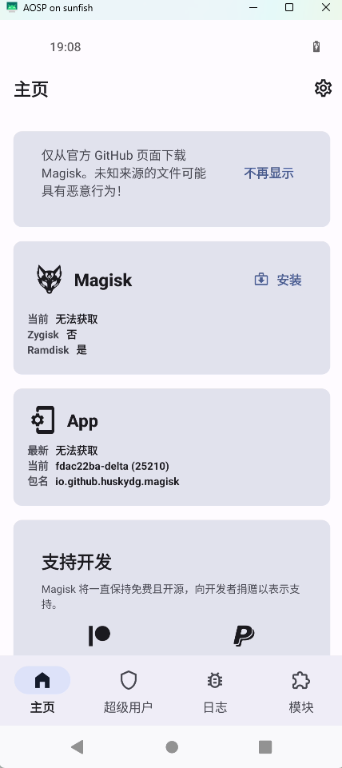

# (2)刷机

刷写设备需要用到 ``fastboot`` 以及 ``adb``

你可以通过 **ubuntu software** 进行安装 **android studio** 里面自带了 **adb和fastboot**
也可以通过 aosp 源码中 构建 **adb和fastboot**

要从源码中构建 **adb和fastboot**输入下面的命令进行构建
```
make fastboot adb
```
它会构建在 ``out/host`` 中,其中有 ``windows``和``linux``。
为了方便,我们将``linux``的拷贝出来
```
# 复制 二进制工具
cp -r out/host/linux-x86/bin ~/android-tools
# 设置环境变量
PATH=~/android-tools:$PATH
# 查看
adb --version
fastboot --version
```
当然为了方便,您可以修改 **.bashrc** 让其永久生效,否则只能在当前窗口生效

## 刷机注意项

刷机前,请用官方包 尝试刷机一次 。注意选择好设备,这样当你变**砖头**的时候可以救回来。
**https://developers.google.com/android/images?hl=zh-cn**


还有,一定要注意 oem 解锁。 不然你会像我一样,得邮寄到高人地方解锁,网上破解oem 资料很少。所以买之前注意了。


## 开始刷机
在此之前看看adb 是否正常工作
```
adb devices
List of devices attached
08041JEC215436	no permissions (missing udev rules? user is in the plugdev group); see [http://developer.android.com/tools/device.html]
```
很明显我出现了问题。
参考解决方案:``https://blog.csdn.net/weixin_42814000/article/details/125626840``

```
cd /etc/udev/rules.d
sudo vim 51-android.rules

SUBSYSTEM=="usb", ENV{DEVTYPE}=="usb_device", MODE="0666"

sudo udevadm control --reload-rules
sudo service udev restart
sudo udevadm trigger
adb kill-server 
adb start-server
```
接下来重新插入手机即可正常显示

### bootloader
刷机需要进入 **bootloader** 进行引导,注意没解锁的需要解锁下

使用下面的命令重启手机并进去 bootloader
```
adb reboot bootloader
```

### fastboot
在使用fastboot 之前,先确认下您的构建路径
```
echo $ANDROID_PRODUCT_OUT
```
如果您没有任何值,可能你关闭过命令窗口。此时需要重新设置环境
```
# 参考上一节
# 启动环境
source build/envsetup.sh
# 选择构建目标
lunch aosp_sunfish-userdebug
# 此时在进行查看
echo $ANDROID_PRODUCT_OUT

~/aosp/out/target/product/sunfish
```

随后可以正式进行刷机
在设备处于 fastboot 模式后，运行以下命令
```
#查看一下
fastboot devices
#根据 ANDROID_PRODUCT_OUT 指向的构建路径 刷新全部镜像分区
fastboot flashall -w
```

-w 选项会擦除设备上的 /data 分区；该选项在您第一次刷写特定设备时非常有用，但在其他情况下则没必要使用。

### 重点来拉!!
你会发现你如何都开不了机,卡在了 ``fastboot``界面。那么恭喜你成功踩坑。
为什么呢？因为它要驱动。难受的是官网一点都没有提到,所以得通过官方出厂刷写工具刷回来。
``https://developers.google.com/android/images?hl=zh-cn``
而官方刷机工具中比我们多了
```
fastboot flash bootloader bootloader-sunfish-s5-0.5-9825683.img
fastboot flash radio radio-sunfish-g7150-00112-230505-b-10075601.img
vendor.img
```
参考``debug_cat``的文章``http://www.debuglive.cn/article/1044719292299345920``
所以我想到两种方案
1. 将我们的 ``boot.img system.img product.img ...``等等覆盖官方刷机包,在进行刷入
2. 下载驱动二进制文件 重新编译

我就选择第二种方案
```
1.下载驱动的两个文件
注意区分下设备
https://developers.google.com/android/drivers?hl=zh-cn

2.解压在aosp 根目录下,会有两个文件
extract-google_devices-sunfish.sh
extract-qcom-sunfish.sh

3.运行它们 后你就可以在 vendor/google_devices/sunfish/proprietary 下看到
bootloader.img
radio.img
vendor.img

4. 重新编译
source build/envsetup.sh
lunch aosp_sunfish-user
m -j1
```

如果您编译失败,那么您需要执行``make clean`` 清理下``out`` 中的缓存.
但是你就会变成全量编译,又得等几个小时了


### 其他问题
默认会给您刷到未激活的slot 比如 b slot(槽) ,如果它启动的时候不知道引导哪个槽
参考解决: ``https://developers.google.com/android/images?hl=zh-cn``
```
    fastboot set_active b
    fastboot reboot bootloader
```

为了方便,可以把引导刷入全部槽
```
fastboot flashall -w --slot=all
```
刷到哪个槽注意看日志
如带有 
```
boot_a
boot_b
system_a
system_b
...
```

完成后重新启动下
```
 fastboot reboot
```

## magisk

为了获取 root 权限。我们需要安装 **magisk** 并修补 ``boot.img``。
关于每个 镜像的作用,参考下面 **chatGpt** 的答案:
```
boot.img（引导镜像）：
boot.img 是 Android 系统的引导镜像，用于启动设备。它包含了 Linux 内核和设备树（Device Tree），以及启动所需的一些初始化脚本和参数。在设备开机时，boot.img 是首先加载和执行的镜像文件。

system.img（系统镜像）：
system.img 是 Android 系统的核心镜像，包含了操作系统的主要组件和应用程序。它包括了框架层、系统应用、系统服务、库文件和其他共享资源。当设备启动完成后，系统镜像会被加载到内存中，并提供给用户在设备上运行各种应用程序。

vendor.img（供应商镜像）：
vendor.img 是供应商定制的镜像文件，包含了设备制造商提供的特定驱动程序、库文件、二进制文件和配置文件。这些文件与设备的硬件和特性有关，而不是由 AOSP 提供。供应商镜像与系统镜像分开，以便供应商可以单独更新和管理自己的部分。

除了上述常见的镜像文件，还有其他一些可能出现的镜像文件，例如：

userdata.img（用户数据镜像）：
userdata.img 包含用户的个人数据，如应用程序数据、设置、多媒体文件等。它是用户在设备上存储数据的主要分区，通常在设备的内部存储器上。

cache.img（缓存镜像）：
cache.img 是系统的缓存分区，用于存储临时文件和应用程序的缓存数据。这些数据可以加快应用程序的启动速度和系统操作的响应速度。

recovery.img（恢复镜像）：
recovery.img 是用于恢复和修复设备的镜像文件。它包含了一个轻量级的恢复系统，可以用于更新系统、进行备份和恢复、清除数据等操作。

这些镜像文件在 AOSP 编译过程中生成，并在设备的启动过程中使用。它们分别承载不同的功能和组件，构成了完整的 Android 操作系统。
```

对于``magisk``我用的 ``magisk delta``,因为它拥有以前 ``magisk`` **隐藏root**的功能


### 安装 magisk delta

参考下载: ``https://huskydg.github.io/magisk-files/intro.html``

当然使用命令更加简单
```
# 下载
wget https://github.com/HuskyDG/magisk-files/releases/download/fdac22ba-delta/app-release.apk

# 安装
adb install app-release.apk
```

接下来你需要将 **boot.img** 拷贝到 手机目录里,然后通过 **matisk** 修补

```
cd out/target/product/sunfish

adb push boot.img /sdcard/
```

接下来看图修补 **boot.img** 并重新刷入

1.点击安装
   


2.选择修补的文件


3.记录修补后的位置,然后 ``adb pull``出来重新刷


```
adb pull /sdcard/Download/magisk_patched-25210_hdiWX.img .

adb reboot bootloader

fastboot flash boot magisk_patched-25210_hdiWX.img

fastboot reboot
```

接下来进手机查看 ``magisk`` 设置下 ``zigisk`` 重启下手机


尝试获取 **root** 权限
```
adb shell su
```

到这里本章节也就结束了

