# android-pixel4a-刷机系列-(4)kernelsu整合内核

你可以参考 ``debug选手``大佬的 ``Pixel3编译的Kernel SU 内核``,这也是提前替我们踩过坑的友人
地址来源: ``http://www.debuglive.cn/article/1091666763961073664``


## kernelSu 简介
KernelSU 是 Android GKI 设备的 root 解决方案，它工作在内核模式，并直接在内核空间中为用户空间应用程序授予 root 权限。

KernelSU 的主要特点是它是基于内核的。 KernelSU 运行在内核空间， 所以它可以提供我们以前从未有过的内核接口。 例如，我们可以在内核模式下为任何进程添加硬件断点；我们可以在任何进程的物理内存中访问，而无人知晓；我们可以在内核空间拦截任何系统调用; 等等。
KernelSU 还提供了一个基于 overlayfs 的模块系统，允许您加载自定义插件到系统中。它还提供了一种修改 /system 分区中文件的机制。

参考官方文档: **https://kernelsu.org/zh_CN/guide/what-is-kernelsu.html**

## 安装kernelSu

首先下载 **kernelsu app** 进行管理。 这个 app 在 酷安中可以找到 **https://www.coolapk.com/apk/me.weishu.kernelsu**

### GKI 内核
在安装 kernelSu 后,你会发现它是这样的


GKI 内核是什么意思呢？
参考官方文档: ``https://source.android.com/docs/core/architecture/kernel/generic-kernel-image?hl=zh-cn``


先说说以前的通用内核(**ACK**)的构造:


大概分为从上往下4个部分:
1.linux内核
2.aosp通用内核
3.供应商外围设备支持
4.Oem设备驱动

> 这就导致了一个问题,**内核碎片化**。
通过官网解释来说,当供应商和Oem设备制造商对 3 和 4 部分的下游内核进行修改后
其官方对上游 1 和 2 内核进行修复更新后导致很难合并升级。
这样对已经在使用的设备就很难或者无法进行安全更新。

所以基于内核碎片化的问题,提供了一种解决方案 通用内核映像(**GKI**)。并提供了 KMI(内核模块接口),来实现内核模块的独立更新,并与
类似之前上游的内核抽离出来

**(所以之前刷内核 必须同步 vendor 的 .ko 内核模块是因为 内核版本的问题？？？希望大佬解答)**

这应该也是为什么 **kernelSu** 只提供 **GKI** 的内核镜像。 否则很难适配各自的 **供应商内核模块对应的内核版本**

下面是 GKI 通用内核镜像的架构图:


基于 GKI 通用内核的方便性,我们只需要 刷入修改过内核的 **boot.img** 即可。对于其内核模块 则应该无需考虑,应为按道理它是通过 ``KMI``与GKI 内核交互的,而不需重建内核模块。当然 KMI 兼容性是和 GKI 内核版本挂钩的,还是稍微得注意下内核版本。

由于我并没有 GKI 内核的设备。 以上只是个人猜测。

下面是基于 GKI **boot 分区**的改动:

#### boot 分区
boot 分区包括头文件、内核以及内含启动 ramdisk 通用部分的 CPIO 归档。

boot 分区使用 v3 版启动头文件后，先前的 boot 分区的以下部分将不复存在：

第二阶段引导加载程序：如果设备具有第二阶段引导加载程序，则必须将相应引导加载程序存储在自己的分区中。
DTB：DTB 存储在供应商启动分区中。
boot 分区包含一个 CPIO 归档，内含以下 GKI 组件：

位于 /lib/modules/ 的 GKI 内核模块
first_stage_init 及其依赖的库
fastbootd 和 recovery（用于 A/B 和虚拟 A/B 设备）
GKI 启动映像由 Google 提供，必须用于 GKI 兼容性测试。

最新的 arm64 android11-5.4 boot.img 可以从 ci.android.com 中 aosp-master 分支的 aosp_arm64 构建工件中下载。

最新的 arm64 android11-5.4 内核映像 (Image.gz) 可以从 ci.android.com 中 aosp_kernel-common-android11-5.4 分支的 kernel_aarch64 构建工件中下载。

#### vendor_boot 分区
供应商启动分区

vendor_boot 分区随 GKI 引入。该分区是采用虚拟 A/B 的 A/B 分区，包含一个头文件、供应商 ramdisk 和设备树 Blob。供应商 ramdisk 是一个 CPIO 归档，其中包含设备启动所需的供应商模块。这包括用于启用关键 SoC 功能的模块，以及启动设备和显示启动画面所需的存储和显示驱动程序。

该 CPIO 归档包含：

第一阶段 init 供应商内核模块，位于 /lib/modules/
modprobe 配置文件，位于 /lib/modules
modules.load 文件，用于指示要在第一阶段 init 期间加载的模块
引导加载程序要求
引导加载程序必须在加载完供应商 ramdisk CPIO 映像（从 vendor_boot 分区）后，立即将通用 ramdisk CPIO 映像（从 boot 分区）加载到内存中。解压缩后，结果是通用 ramdisk 叠加在供应商 ramdisk 的文件结构之上。

>到这里其实就能发现一点,供应商内核模块不仅仅可以在 vendor/lib/modules 中,还可以放在 vendor ramdisk 中的 /lib/modules 中,并通过 modules.load 指定加载,这应该可以解决上一篇 内核模块的问题。但这里是 gki 内核,拥有vendor_boot 分区,我们并没有。

### GKI内核刷入KernelSu
您可以到他的**github release** 中下载对应内核的 **boot.img** 进行刷入(建议用``AnyKernel3``刷机包)。由于我并没有 基于 GKI 内核的
**pixel** 设备所以不方便展示。但理论GKI的内核设备,应该都很容易刷上去,注意下压缩格式即可。

### Dessert 内核刷入

目前 dessert 内核最高支持到 ``android-4.19-stable``。
而 gki 内核 是从 ``android11-5.4``开始
查看内核版本可以通过 **kernelSu app** 记录的信息,或者通过 ``cat /proc/version``进行查看

非 GKI 内核设备 需要我们自己构建内核集成 **kernelSu**。所以下面的过程会比较麻烦。

## 构建KernelSu

如果您的是非 GKI 内核设备,那就老老实实手动编译吧。
当然也有些大佬自己编译好了,你可以参考: **https://kernelsu.org/zh_CN/guide/unofficially-support-devices.html** 。
或者靠运气去 **github** 上面搜搜

首先在你的 **android kernel** 的根目录下下载 **kernelSu**
```
# 进入到 内核根目录
cd  ~/android-kernel/private/msm-google
# 运行脚本  克隆 kernelSu main 分支代码 并处理
curl -LSs "https://raw.githubusercontent.com/tiann/KernelSU/main/kernel/setup.sh" | bash -s main
```

随后运行 ``build/build.sh`` 进行编译

**但是你可能会出现下面的错误**
```
....
--- private/msm-google/arch/arm64/configs/sunfish_defconfig	2023-06-27 15:56:28.068070234 +0800
+++ ~/aosp/android-kernel/out/android-msm-pixel-4.14/private/msm-google/defconfig	2023-06-27 22:37:59.857566122 +0800
@@ -685,7 +685,6 @@
 CONFIG_QUOTA_NETLINK_INTERFACE=y
 CONFIG_QFMT_V2=y
 CONFIG_FUSE_FS=y
-CONFIG_OVERLAY_FS=y
 CONFIG_INCREMENTAL_FS=m
 CONFIG_VFAT_FS=y
 CONFIG_TMPFS_POSIX_ACL=y
++ RES=1
++ '[' 1 -ne 0 ']'
++ echo ERROR: savedefconfig does not match private/msm-google/arch/arm64/configs/sunfish_defconfig
ERROR: savedefconfig does not match private/msm-google/arch/arm64/configs/sunfish_defconfig
++ return 1

```

大致意思是说 ``sunfish_defconfig`` 与 ``savedefconfig``的输出产物 ``out/android-msm-pixel-4.14/private/msm-google/defconfig``内容不匹配

这是什么意思呢？
哈哈哈，不懂呀不懂呀。
百度根本没有答案。


只能勉强说下我这几天看的资料
参考: ``https://blog.csdn.net/u011570492/article/details/55803327``

大致能理解的是有几个配置文件分别是
```
# menuconfig 配置项
Kconfig
# 通过 .config 生成的选择指定架构的定义项 
xxx_defconfig
# 通过 menuconfig 配置后的 .config
.config
```

下面我将进行操作

### 配置KernelSu
Kconfig 在每个目录下都有,就比如你进入``kernelsu`` 就会发现这个 Kconfig文件
```
cd private/msm-google/drivers/kernelsu
ls |grep config
Kconfig
```

查看 ``Kconfig``中,发现他已经给我们定义好了``OVERLAY_FS``选项以及``KSU_DEBUG``
```
menu "KernelSU"

config KSU
	tristate "KernelSU function support"
	select OVERLAY_FS
	default y
	help
	Enable kernel-level root privileges on Android System.

config KSU_DEBUG
	bool "KernelSU debug mode"
	depends on KSU
	default n
	help
	Enable KernelSU debug mode

endmenu
```

我们可以在菜单配置选项界面进行配置

在内核源码根目录运行 ``make menuconfig`` 
你会看到这种界面

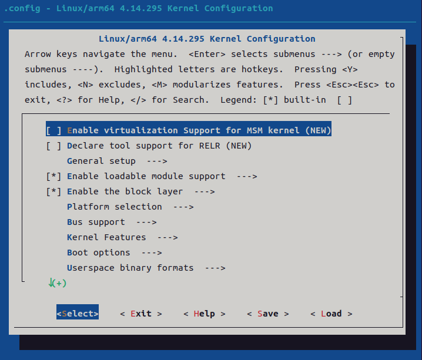

然后输入 ``/`` 进入搜索界面，输入 ``ksu`` 也就是 ``KernelSu`` 中的 ``Kconfig``配置


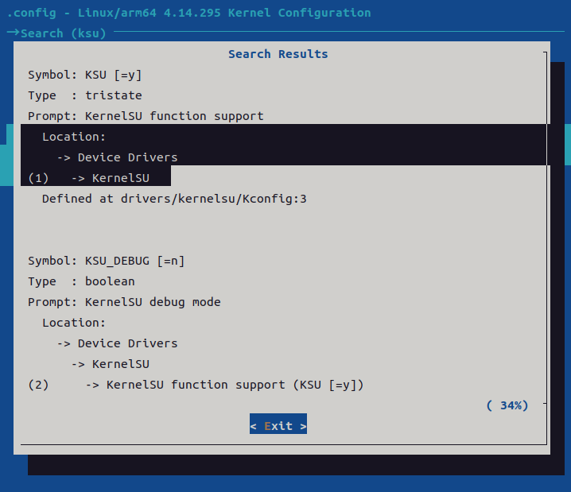

```
可以看道它位于 配置项

│   Location:                                                             │  
  │     -> Device Drivers                                                   │  
  │ (1)   -> KernelSU  

配置路径为 drivers/kernelsu/Kconfig:3  
```


我们跟到这个地方去

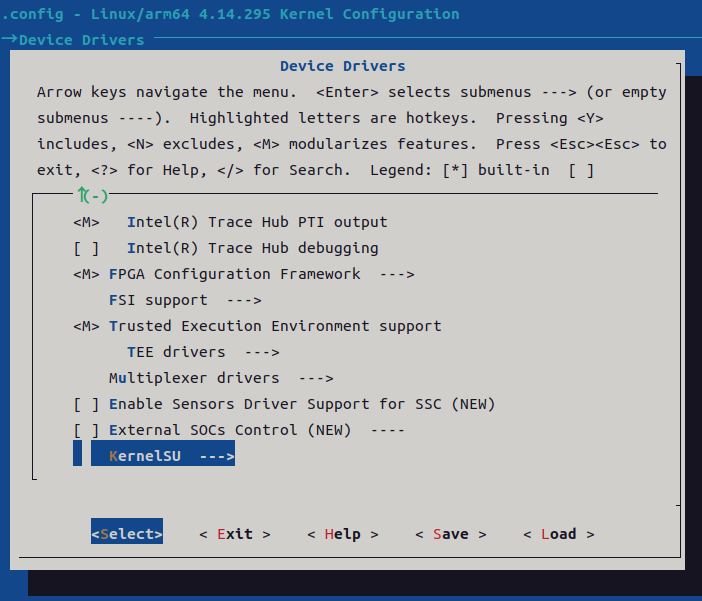

你就可以看到 ``tristate "KernelSU function support"``选项

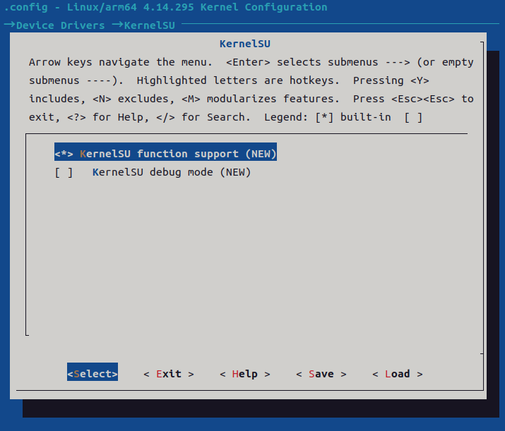

它对应着 ``KernelSu Kconfig`` 的

```
config KSU
	tristate "KernelSU function support"
    ....
```    
```
`tristate` 是一个配置选项的类型，它表示可以有三个可能的值：`y`（yes）、`n`（no）和 `m`（module）。

在这个特定的配置选项中，`tristate "KernelSU function support"` 表示一个带有三个可能状态的选项，用于确定是否支持 "KernelSU" 功能。具体含义如下：

- `y`（yes）：选择此选项表示启用 "KernelSU" 功能，并将其编译到内核中。
- `n`（no）：选择此选项表示禁用 "KernelSU" 功能，并不将其编译到内核中。
- `m`（module）：选择此选项表示将 "KernelSU" 功能编译为内核模块，可以在运行时加载和卸载。使用模块的方式可以在不重新编译整个内核的情况下启用或禁用 "KernelSU"。

因此，通过选择适当的值（`y`、`n` 或 `m`），可以决定是否启用 "KernelSU" 功能，并确定它是作为内核的一部分编译还是作为可加载的内核模块进行处理。
```

在回顾之前的错误
```
--- private/msm-google/arch/arm64/configs/sunfish_defconfig	2023-06-27 15:56:28.068070234 +0800
+++ ~/aosp/android-kernel/out/android-msm-pixel-4.14/private/msm-google/defconfig	2023-06-27 22:37:59.857566122 +0800
@@ -685,7 +685,6 @@
 CONFIG_QUOTA_NETLINK_INTERFACE=y
 CONFIG_QFMT_V2=y
 CONFIG_FUSE_FS=y
-CONFIG_OVERLAY_FS=y
 CONFIG_INCREMENTAL_FS=m
 CONFIG_VFAT_FS=y
 CONFIG_TMPFS_POSIX_ACL=y
++ RES=1
++ '[' 1 -ne 0 ']'
++ echo ERROR: savedefconfig does not match private/msm-google/arch/arm64/configs/sunfish_defconfig
ERROR: savedefconfig does not match private/msm-google/arch/arm64/configs/sunfish_defconfig
++ return 1
```

通过 ``savedefconfig`` 生成的 ``defconfig`` 与 ``sunfish_defconfig`` 比对结果差异就在 ``-CONFIG_OVERLAY_FS=y``

所以我把 ``select OVERLAY_FS``注释掉后就成功编译了,如下:
```
menu "KernelSU"

config KSU
	tristate "KernelSU function support"
#	select OVERLAY_FS
	default y
	help
	Enable kernel-level root privileges on Android System.
```

原理我并不知道为什么,之后会不会有问题,不过还是先了解下 ``defconfig`` 

### defconfig

defconfig 按照解释是说 每个 架构设备 的 默认建议配置

一般是在 ``arch/xxx/configs``下
那么 ``arm64`` 我们查看一下:

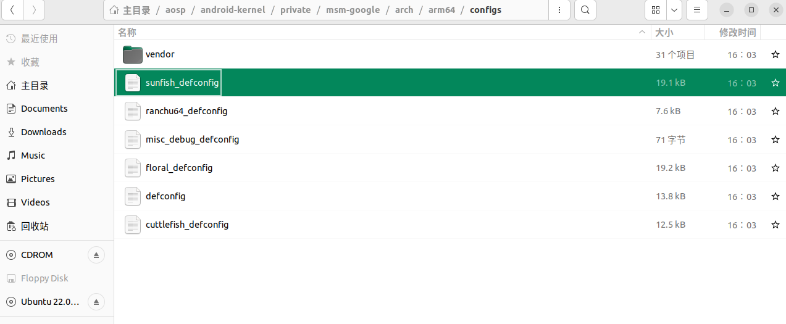

发现我们编译使用到的 ``sunfish_defconfig``,搜索的话也确实找到了 ``CONFIG_OVERLAY_FS=y``

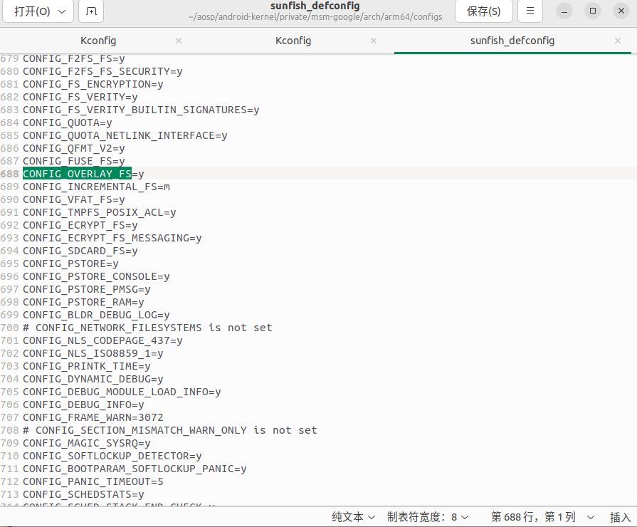

那么也就是说之前报错 ``saveconfig`` 出的 ``defconfig`` 与 ``sunfish_defconfig`` 缺少的项就是这个了。

但是注释掉 ``kernelSu Kconfig`` 中的 ``select OVERLAY_FS`` 后 编译就不缺少了。

> 这是为什么呢？
这是为什么呢？
这是为什么呢？
这是为什么呢？
这是为什么呢？


## 刷入KernelSu 内核

编译后搜索一下 

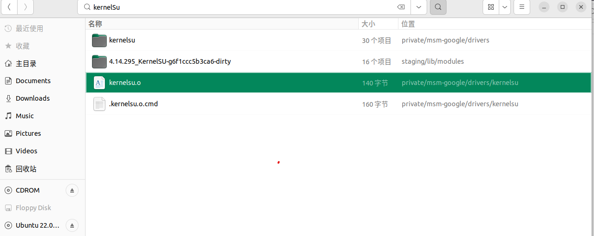

发现存在 ``kernelSu`` 模块,不是说 ``tristate``类型是编译到内核里吗？ 百思不得其解呀~
```
config KSU
	tristate "KernelSU function support"
#	select OVERLAY_FS
	default y
	help
	Enable kernel-level root privileges on Android System.
```    

算了司马当活马医。 直接刷入看看

### 测试内核

``kernelSu``本身是使用``kprobe`` hook 系统内核实现的功能,所以按道理我们不需要做其他更改了,直接测试就行了
当然我不敢保证,毕竟有的内核版本 连 ``kprobe``都无法支持,我也对内核理解不多。

我们可以直接通过 fastboot 刷入内核启动文件``Image.lz4-dtb`` 进行测试内核

```
adb reboot bootloader
fastboot boot Image.lz4-dtb
```

然后打开 ``kernelSu`` 的 app 进行查看

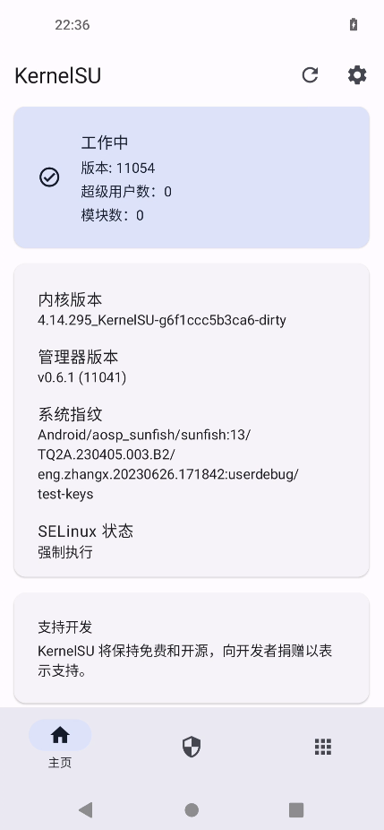


### 集成到 boot.img
重新编译 ``aosp``过于麻烦,所以我们使用 ``aik`` 也就是 ``android image kitchen``

网站介绍: ``https://forum.xda-developers.com/t/tool-android-image-kitchen-unpack-repack-kernel-ramdisk-win-android-linux-mac.2073775/``

注意下载:``AIK-Linux-v3.8-ALL.tar.gz`` 。当然它也有github ``https://github.com/osm0sis/Android-Image-Kitchen``
你可以下载它的 ``linux`` 分支 或者 ``windows``

下载完后解压你会发现有几个重要的脚本

```
# 清理解包数据
cleanup.sh
# 重打包
repackimg.sh
# 解包
unpackimg.sh
```

将 ``boot.img`` 放入到 ``aik``目录中,直接运行 ``unpacking.sh``
你会看到多出2个文件夹

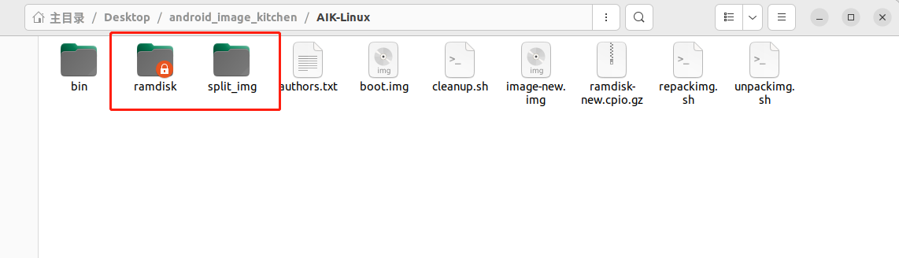

主要注意 ``split_img`` 目录,将里面的 ``boot.img-kernel`` 替换成你的启动内核``Image.lz4-dtb``注意替换的时候名字要改成一样


接下来直接调用 ``repackimg.sh`` 它会重打包成 ``image-new.img``

接下来执行下面的命令进行刷入
```
adb reboot bootloader
fastboot flash boot image-new.img``
```

## kernelsu测试

刷入后你会发现用不了

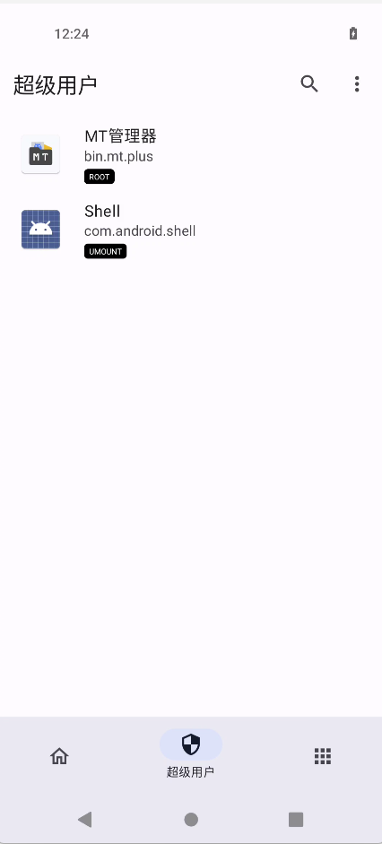

如何排查呢？


要排查问题肯定离不开日志,在 ``kernelSu``的源码中

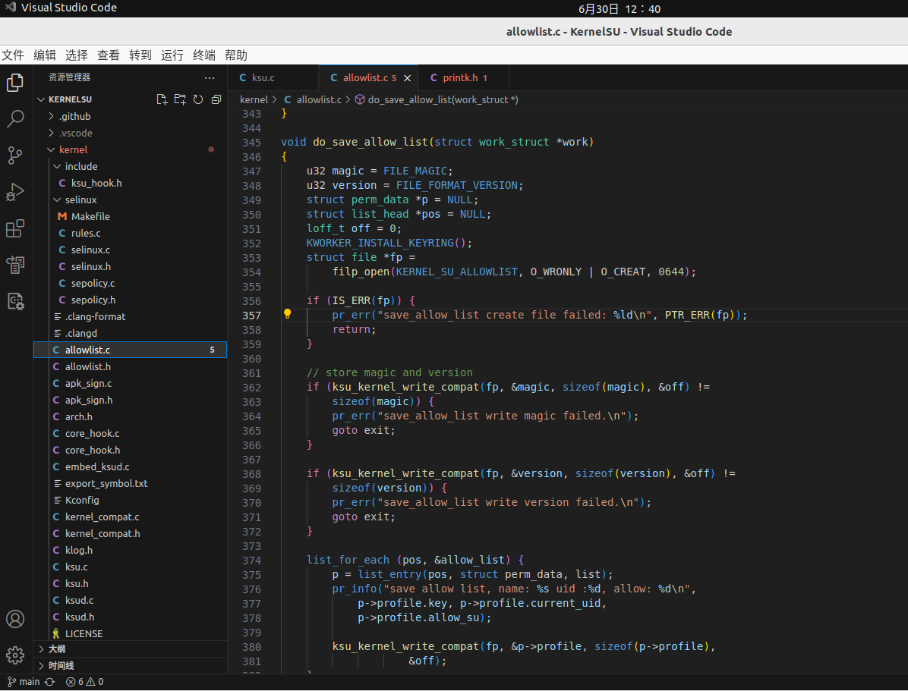

几乎每个地方都有日志的输出

日志使用的是 **内核中的printk**


根据网上查的资料来说: [https://www.cnblogs.com/ArsenalfanInECNU/p/16952781.html](https://www.cnblogs.com/ArsenalfanInECNU/p/16952781.html)

可以使用 
```
# 从kernel的ring buffer(环缓冲区)中读取信息
dmesg 
dmesg -w # 实时获取日志
dmesg -C # 清楚 ringbuf

# /proc/kmsg是专门输出内核信息的地方,为了能够方便的在 user space 读取 Kernel log，Kernel driver 里面将ring buffer映射到了 /proc 目录下的文件节点 /proc/kmsg。所以读取 /proc/kmsg 文件其实就是在访问 Kernel Log 的循环缓冲区。虽然 Log buffe的大小是固定的，但是可以通过不断的访问 /proc/kmsg 将所有的log都备份下来。

#实时显示内核打印信息并保存到android_kmsg.log文件中
adb shell cat /proc/kmsg |tee android_kmsg.log
```

所有按照 ``klog.h`` 覆盖的宏定义

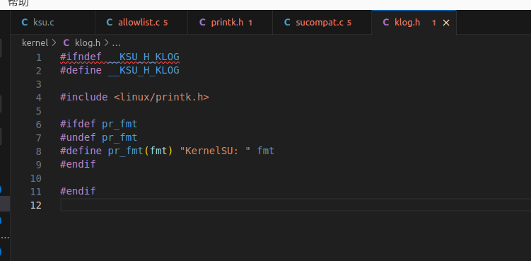

我们可以直接搜索 ``KernelSu``,使用命令``dmesg -w|grep KernelSU``进行实时跟踪

```
# dmesg -w|grep KernelSU              

[  749.835666] KernelSU: save allow list, name: bin.mt.plus uid :10107, allow: 1

[ 1311.425279] KernelSU: save allow list, name: bin.mt.plus uid :10107, allow: 0
[ 1312.981342] KernelSU: save allow list, name: bin.mt.plus uid :10107, allow: 1
[ 1313.578734] KernelSU: save allow list, name: bin.mt.plus uid :10107, allow: 0
[ 1314.041084] KernelSU: save allow list, name: bin.mt.plus uid :10107, allow: 1
[ 1376.168834] KernelSU: do_execveat_common su found
[ 1376.168876] KernelSU: error: 0, sid: 833
[ 1376.188984] KernelSU: do_execveat_common su found
[ 1376.189022] KernelSU: error: 0, sid: 833
[ 1417.165194] KernelSU: newfstatat su->sh!
[ 1417.165234] KernelSU: faccessat su->sh!
[ 1417.165927] KernelSU: do_execveat_common su found
[ 1417.165968] KernelSU: error: 0, sid: 833
```

当然我这里的日志是通过的,因为我解决了,但是难得重现问题记录笔记,但我可以明确告诉你是``kprobe``的配置问题。

下一节将正式告诉你如何正确配置``defconfig``并启用``kprobe``。