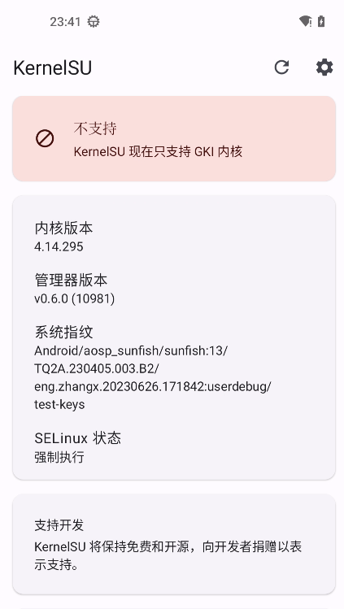
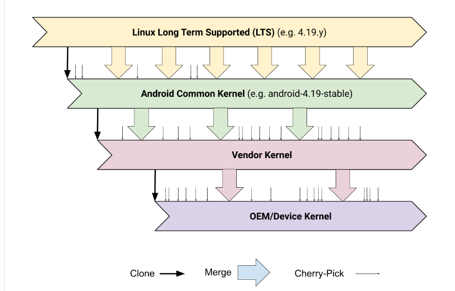
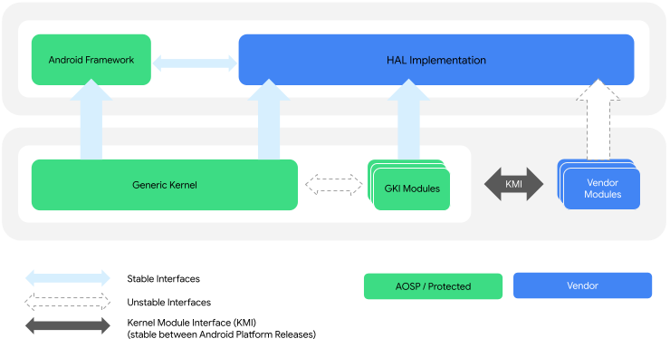

# kernelSu 内核编译及刷入

你可以参考 ``debug选手``大佬的 ``Pixel3编译的Kernel SU 内核``。
地址来源: ``http://www.debuglive.cn/article/1091666763961073664``

我也是基于 ``debug_cat``上进行 内核的修改。


## kernelSu 简介
KernelSU 是 Android GKI 设备的 root 解决方案，它工作在内核模式，并直接在内核空间中为用户空间应用程序授予 root 权限。

KernelSU 的主要特点是它是基于内核的。 KernelSU 运行在内核空间， 所以它可以提供我们以前从未有过的内核接口。 例如，我们可以在内核模式下为任何进程添加硬件断点；我们可以在任何进程的物理内存中访问，而无人知晓；我们可以在内核空间拦截任何系统调用; 等等。
KernelSU 还提供了一个基于 overlayfs 的模块系统，允许您加载自定义插件到系统中。它还提供了一种修改 /system 分区中文件的机制。

参考官方文档: **https://kernelsu.org/zh_CN/guide/what-is-kernelsu.html**

## 安装kernelSu

首先下载 **kernelsu app** 进行管理。 这个 app 在 酷安中可以找到 **https://www.coolapk.com/apk/me.weishu.kernelsu**

### GKI 内核
在安装 kernelSu 后,你会发现它是这样的



GKI 内核是什么意思呢？
参考官方文档: ``https://source.android.com/docs/core/architecture/kernel/generic-kernel-image?hl=zh-cn``


先说说以前的通用内核(**ACK**)的构造:



大概分为从上往下4个部分:
1.linux内核
2.aosp通用内核
3.供应商外围设备支持
4.Oem设备驱动

> 这就导致了一个问题,**内核碎片化**。
通过官网解释来说,当供应商和Oem设备制造商对 3 和 4 部分的下游内核进行修改后
其官方对上游 1 和 2 内核进行修复更新后导致很难合并升级。
这样对已经在使用的设备就很难或者无法进行安全更新。

所以基于内核碎片化的问题,提供了一种解决方案 通用内核映像(**GKI**)。并提供了 KMI(内核模块接口),来实现内核模块的独立更新,并与
类似之前上游的内核抽离出来

**(所以之前刷内核 必须同步 vendor 的 .ko 内核模块是因为 内核版本的问题？？？希望大佬解答)**

所以这也是为什么 **kernelSu** 只提供 **GKI** 的内核镜像。 否则很难适配各自的 **内核模块 .ko文件**

下面是 GKI 通用内核镜像的架构图:



基于 GKI 通用内核的方便性,我们只需要 刷入修改过内核的 **boot.img** 即可。对于其内核模块 则应该无需考虑,应为按道理它是通过 ``KMI``与GKI 内核交互的,而不需重建内核模块。当然 KMI 兼容性是和 GKI 内核版本挂钩的,注意下内核版本。

由于我并没有 GKI 内核的设备。 以上只是个人猜测。

下面是基于 GKI **boot 分区**的改动:

#### boot 分区
boot 分区包括头文件、内核以及内含启动 ramdisk 通用部分的 CPIO 归档。

boot 分区使用 v3 版启动头文件后，先前的 boot 分区的以下部分将不复存在：

第二阶段引导加载程序：如果设备具有第二阶段引导加载程序，则必须将相应引导加载程序存储在自己的分区中。
DTB：DTB 存储在供应商启动分区中。
boot 分区包含一个 CPIO 归档，内含以下 GKI 组件：

位于 /lib/modules/ 的 GKI 内核模块
first_stage_init 及其依赖的库
fastbootd 和 recovery（用于 A/B 和虚拟 A/B 设备）
GKI 启动映像由 Google 提供，必须用于 GKI 兼容性测试。

最新的 arm64 android11-5.4 boot.img 可以从 ci.android.com 中 aosp-master 分支的 aosp_arm64 构建工件中下载。

最新的 arm64 android11-5.4 内核映像 (Image.gz) 可以从 ci.android.com 中 aosp_kernel-common-android11-5.4 分支的 kernel_aarch64 构建工件中下载。

#### vendor_boot 分区
供应商启动分区

vendor_boot 分区随 GKI 引入。该分区是采用虚拟 A/B 的 A/B 分区，包含一个头文件、供应商 ramdisk 和设备树 Blob。供应商 ramdisk 是一个 CPIO 归档，其中包含设备启动所需的供应商模块。这包括用于启用关键 SoC 功能的模块，以及启动设备和显示启动画面所需的存储和显示驱动程序。

该 CPIO 归档包含：

第一阶段 init 供应商内核模块，位于 /lib/modules/
modprobe 配置文件，位于 /lib/modules
modules.load 文件，用于指示要在第一阶段 init 期间加载的模块
引导加载程序要求
引导加载程序必须在加载完供应商 ramdisk CPIO 映像（从 vendor_boot 分区）后，立即将通用 ramdisk CPIO 映像（从 boot 分区）加载到内存中。解压缩后，结果是通用 ramdisk 叠加在供应商 ramdisk 的文件结构之上。

### GKI内核刷入KernelSu
您可以到他的**github release** 中下载对应内核的 **boot.img** 进行刷入(建议用``AnyKernel3``刷机包)。由于我并没有 基于 GKI 内核的
**pixel** 设备所以不方便展示。但理论GKI的内核设备,应该都很容易刷上去,注意下压缩格式即可。

### Dessert 内核刷入

目前 dessert 内核最高支持到 ``android-4.19-stable``。
而 gki 内核 是从 ``android11-5.4``开始
查看内核版本可以通过 **kernelSu app** 记录的信息,或者通过 ``cat /proc/version``进行查看

非 GKI 内核设备 需要我们自己构建内核集成 **kernelSu**。所以下面的过程会比较麻烦。

## 构建KernelSu

如果您的是非 GKI 内核设备,那就老老实实手动编译吧。
当然也有些大佬自己编译好了,你可以参考: **https://kernelsu.org/zh_CN/guide/unofficially-support-devices.html** 。
或者靠运气去 **github** 上面搜搜

首先在你的 **android kernel** 的根目录下下载 **kernelSu**
```
# 进入到 内核根目录
cd  ~/android-kernel/private/msm-google
# 运行脚本 下载 kernelSu 稳定版分支代码
curl -LSs "https://raw.githubusercontent.com/tiann/KernelSU/main/kernel/setup.sh" | bash -
```

随后运行 ``build/build.sh`` 进行编译

**但是你可能会出现下面的错误**
```
....
--- private/msm-google/arch/arm64/configs/sunfish_defconfig	2023-06-27 15:56:28.068070234 +0800
+++ /home/zhangxuan/aosp/android-kernel/out/android-msm-pixel-4.14/private/msm-google/defconfig	2023-06-27 22:37:59.857566122 +0800
@@ -685,7 +685,6 @@
 CONFIG_QUOTA_NETLINK_INTERFACE=y
 CONFIG_QFMT_V2=y
 CONFIG_FUSE_FS=y
-CONFIG_OVERLAY_FS=y
 CONFIG_INCREMENTAL_FS=m
 CONFIG_VFAT_FS=y
 CONFIG_TMPFS_POSIX_ACL=y
++ RES=1
++ '[' 1 -ne 0 ']'
++ echo ERROR: savedefconfig does not match private/msm-google/arch/arm64/configs/sunfish_defconfig
ERROR: savedefconfig does not match private/msm-google/arch/arm64/configs/sunfish_defconfig
++ return 1

```

大致意思是说 ``sunfish_defconfig`` 与 ``savedefconfig``的输出产物 ``out/android-msm-pixel-4.14/private/msm-google/defconfig``内容不匹配

这是什么意思呢？
这个我们得了解下配置文件

### 构建的配置文件


```
rm -rf !(".repo")
repo sync
```

```
adb root
adb shell cat /proc/kallsyms | grep kprobe
0000000000000000 t kprobe_prog_func_proto
0000000000000000 t kprobe_prog_is_valid_access
0000000000000000 T __kprobes_text_end
0000000000000000 T __kprobes_text_start
0000000000000000 R kprobe_prog_ops
```