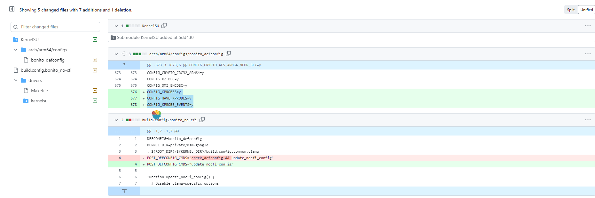
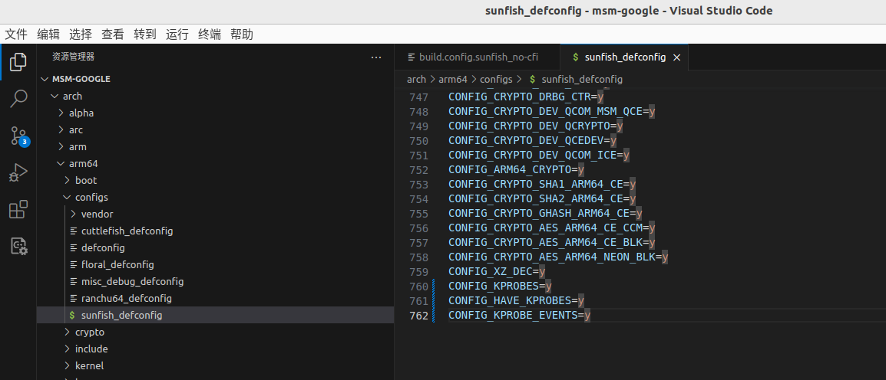

# (5)修复编译kernelSu的问题及使用

可能你也尝试编译了kernelSu 并成功刷入,但是发现使用并没有效果,接下来我们逐步排查进行修复。

## 重编译

首先我想到的是上一篇 出现 ``savedefconfig`` 不匹配的问题

```
....
--- private/msm-google/arch/arm64/configs/sunfish_defconfig	2023-06-27 15:56:28.068070234 +0800
+++ ~/aosp/android-kernel/out/android-msm-pixel-4.14/private/msm-google/defconfig	2023-06-27 22:37:59.857566122 +0800
@@ -685,7 +685,6 @@
 CONFIG_QUOTA_NETLINK_INTERFACE=y
 CONFIG_QFMT_V2=y
 CONFIG_FUSE_FS=y
-CONFIG_OVERLAY_FS=y
 CONFIG_INCREMENTAL_FS=m
 CONFIG_VFAT_FS=y
 CONFIG_TMPFS_POSIX_ACL=y
++ RES=1
++ '[' 1 -ne 0 ']'
++ echo ERROR: savedefconfig does not match private/msm-google/arch/arm64/configs/sunfish_defconfig
ERROR: savedefconfig does not match private/msm-google/arch/arm64/configs/sunfish_defconfig
++ return 1

```

之前我们的解决方案是 注释掉 ``KernelSu`` 的 ``Kconfig`` 中的 ``select OVERLAY_FS`` 选项
```
menu "KernelSU"

config KSU
	tristate "KernelSU function support"
	#select OVERLAY_FS
	default y
	help
	Enable kernel-level root privileges on Android System.
```    

这样确实 ``ok`` 了。但总感觉这样不是正确的解决办法。
所以我通过查看 其他人的仓库修改



确认了几个修改位置。

### 去掉 check_defconfig 

在 ``build/build.sh`` 脚本中,我发现了这样一段代码
```
if [ -z "${SKIP_DEFCONFIG}" ] ; then
set -x
(cd ${KERNEL_DIR} && make "${TOOL_ARGS[@]}" O=${OUT_DIR} ${MAKE_ARGS} ${DEFCONFIG})
set +x

if [ -n "${POST_DEFCONFIG_CMDS}" ]; then
  echo "========================================================"
  echo " Running pre-make command(s):"
  set -x
  eval ${POST_DEFCONFIG_CMDS}
  set +x
fi
fi
```

重点看 ``POST_DEFCONFIG_CMDS`` 这会在调用 ``make xx  xxx_defconfig`` 生成``.config``后调用一些命令。

我们看下 ``private/msm-google/build.config`` 文件
```
KERNEL_DIR=private/msm-google
. ${ROOT_DIR}/${KERNEL_DIR}/build.config.common.clang
POST_DEFCONFIG_CMDS="check_defconfig"
```

发现他调用了 ``check_defconfig``方法,这个方法在哪里呢？

回到 ``build`` 目录下你会发现一个叫 ``_setup_env.sh``的文件
```
echo
echo "PATH=${PATH}"
echo

# verifies that defconfig matches the DEFCONFIG
function check_defconfig() {
    (cd ${OUT_DIR} && \
     make "${TOOL_ARGS[@]}" O=${OUT_DIR} savedefconfig)
    [ "$ARCH" = "x86_64" -o "$ARCH" = "i386" ] && local ARCH=x86
    echo Verifying that savedefconfig matches ${KERNEL_DIR}/arch/${ARCH}/configs/${DEFCONFIG}
    RES=0
    diff -u ${KERNEL_DIR}/arch/${ARCH}/configs/${DEFCONFIG} ${OUT_DIR}/defconfig ||
      RES=$?
    if [ ${RES} -ne 0 ]; then
        echo ERROR: savedefconfig does not match ${KERNEL_DIR}/arch/${ARCH}/configs/${DEFCONFIG}
    fi
    return ${RES}
}

```

它里面就有 ``check_defconfig`` 方法,可以看到它通过 ``make ... savedefconfig`` 从``.config``提取的 ``defconfig``。
并使用 ``diff``进行比较差异。
这就难受了,因为我修改 ``arch/arm64/configs/xxx_defconfig``后。``make ... savedfconfig`` 从 ``.config``总是提取的 ``defconfig``成我未修改前的样子,**百思不得其解** **百思不得其解** **百思不得其解** 

那好,砸门去掉这个。只不过不是去掉 ``build.config``里的。

而是去掉 ``build_sunfish.sh``里的


它里面的配置指向了 ``build.config.sunfish_no-cfi``,所以我们改这个
```
BUILD_CONFIG=private/msm-google/build.config.sunfish_no-cfi build/build.sh "$@"
```

改成如下
```
KERNEL_DIR=private/msm-google
. ${ROOT_DIR}/${KERNEL_DIR}/build.config.sunfish.common.clang
#POST_DEFCONFIG_CMDS="check_defconfig && update_nocfi_config"
POST_DEFCONFIG_CMDS="update_nocfi_config"

function update_nocfi_config() {
  # Disable clang-specific options
  ${KERNEL_DIR}/scripts/config --file ${OUT_DIR}/.config \
    -d LTO \
    -d LTO_CLANG \
    -d CFI \
    -d CFI_PERMISSIVE \
    -d CFI_CLANG
  (cd ${OUT_DIR} && \
   make ${CC_LD_ARG} O=${OUT_DIR} olddefconfig)
}
```

只不过构建的时候不是调用 ``build/build.sh`` 了,而是直接调用 ``build_sunfish.sh``

### kprobe 配置
kernelSu 通过 kprobe 去 hook 内核 实现的功能。所以我们得让编译的内核支持 ``kprobe``
在 ``arch/arm64/configs/xxx_defconfig``添加如下配置
```
CONFIG_KPROBES=y
CONFIG_HAVE_KPROBES=y
CONFIG_KPROBE_EVENTS=y
```



### 构建时候强调点问题
如果发现你已经改的很乱了,然后编译出现其他报错。

那么请恢复之前可以构建的时候,在重新 拉 ``kernelsu``的代码

```
# 只删除代码,不删除``repo``仓库
rm -rf !(".repo")
# 重新同步
repo sync

cd private/msm-google

curl -LSs "https://raw.githubusercontent.com/tiann/KernelSU/main/kernel/setup.sh" | bash -s main
```

## kernelsu 使用

